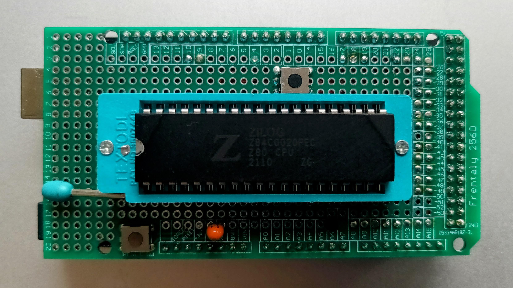
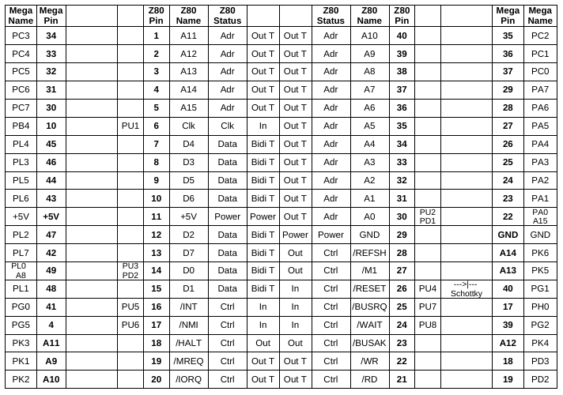

[//]: # (SPDX-License-Identifier: GPL-3.0-or-later)

# Arduino and ZiLOG Z80


My Z80 dongle tests a grinded NMOS Z80 pretending to be an 84C0020

The idea and the software is taken from [Goran Devic](https://baltazarstudios.com/arduino-zilog-z80/).

If you want to find out exactly what a venerable Z80 is doing on its bus
while executing instructions, my hardware and the firmware will let you see that.
Using just a few components and connecting them to an Arduino Mega, you can trace
instructions clock by clock and observe what's happening on the bus.

## Hardware

This is a 1st rough sketch, taken from Goran's post:


These are the actual connections on my proto board:



There is a capacitor between +5V and GND which should help keep away any voltage noise.
You can use anything: I use a 2.2uF tantalum cap. The evil thing with not
putting bypass (or decoupling) caps in your designs is that you may never find out
why they might behave erratically.

There is also a push button above the CPU socket, which is optional.
In contrast to Goran's *sketch* it is connected to the pulled-up /RESET pin of the Z80 CPU.
A Schottky diode decouples the Arduino output from the switch, converting the push-pull output
into a kind of open collector pull-down.
Another push button at the lower edge of the proto board resets the Arduino Mega.

Now, the most interesting extension in Gorans design is the tri-state bus detection.

Z80 occasionally puts its address and data buses into `High-Z`, or tri-state,
and to detect that (it also lets some of its control pins (/RD, /WR, /MREQ, /IORQ) to Z,
but it is sufficient to detect only the two major buses.) There are 2 pull-down resistors
(each 10k) making up a weak resistor divider network together with the pull-ups connected
to pins D0 and A0. I use a 10k sil resistor network that pulls also all Z80 control inputs up.
That way, whenever Z80 releases its data or address bus, the pins will assume 2.5V
pulled by resistor dividers. Since both bus pins A0 and D0 are also connected to analog
input pins, Arduino will be able to read the voltage and clearly detect that they are not
0V or 5V (logical 0 or 1) but somewhere in between.

The Arduino Mega board is really useful here since it hosts more I/O pins than you'd
ever need, runs on +5V, and therefore needs no voltage level translators to talk to Z80.

The Mega ports are conveniently clustered by their function:
All eight data lines together, 16 address lines, control signals, and a few odd ones:
clock, which goes to pin 10 on Arduino which is a PWM output that allows to clock the CPU,
also +5V and GND.

I got the Mega proto board, the Textool (clone) socket and some Z80 CPUs from Hein Pragt's
[retro electronics part webshop](https://www.heinpragt.nl/). Hein uses a similar
[Z80 / Arduino setup](https://www.heinpragt-software.com/z80-on-arduimo-mega/)
to run Z80 programs using the Arduino Mega as ROM, RAM, and IO interface.
I use the same connections for my Z80 dongle as Hein, so his SW (e.g. a Basic interpreter)
runs also on my dongle.

## Firmware

The Mega firmware is taken from Goran, I adapted it to my changed connections and added
commands for memory modification and memory dump. The Arduino communicates via the USB serial connection to the PC with 115200 bps,
you can use either the serial monitor of the Arduino IDE or any serial terminal program.
I use e.g. minicom or picocom on Linux, also the Arduino serial monitor can be used.

Connected through a serial port, you have several commands available (type `?` or `h`
at the console):

```
  A               - analyse Grant Searle's ROM Basic
  Ax              - analyse Hein Pragt's ROM Basic
  B               - execute Grant Searle's ROM Basic
  Bx              - execute Hein Pragt's ROM Basic
  #               - show simulation variables
  #N VALUE        - set simulation variable number N to a VALUE
  #R              - reset simulation variables to their default values
  R               - run the simulation from start 0x0000
  S               - single-step the simulation from start 0x0000
  C               - continue the simulation after halt
  :INTEL-HEX      - reload RAM buffer with ihex data stream
  .INTEL-HEX      - reload IO buffer with a modified ihex data stream
  M START END     - dump the RAM buffer from START to END
  MX START END    - dump the RAM buffer as ihex from START to END
  MR              - reset the RAM buffer to 00
  MS ADR B B B .. - set RAM buffer at ADR with data byte(s) B
  I START END     - dump the IO buffer from START to END
  IX START END    - dump the IO buffer as modified ihex from START to END
  IR              - reset the IO buffer to 00
  IS ADR B B B .. - set IO buffer at ADR with data byte(s) B
  E0              - set echo off
  E1              - set echo on (default)
  VN              - set verboseMode to N (default = 0)
```

There are several internal simulation variables that you can change in order to run your tests
on Z80 in various ways. The best way is to create a small test program.
I use the `z80assembler` from the [sarnau/Z80DisAssembler](https://github.com/sarnau/Z80DisAssembler)
package.


## Analysing the Z80

<details>
<summary>For example, create a test like this:</summary>

```
; test for IM2
stack   equ $100
        ld hl, counter
        ld sp, stack
        ld a,$55
        ld (hl),a
        ld c,$55
        out (c),0
        ld a,im2vector >> 8
        ld i,a ; high part of int vector
        im 2
        ei
        jr $ ; wait for interrupt

counter
        defs 1

        org $20 ; int routine
im2routine
        inc (hl)
        ei
        reti


        org $30 ; int vector
im2vector
        defw im2routine

        org $38 ; RST38 / IM 1 routine
        inc (hl)
        ei
        reti

        org $66 ; NMI routine
        dec (hl)
        ei
        retn
```
</details>

Functionally, this sequence does not make much sense, but it lets us test several things
by inserting an NMI and INT at certain places we can trace what's going on
when the CPU is servicing those interrupts.

<details>
<summary>Assembler output:</summary>

```
                        ; test for IM2
                        stack   equ $100
0000    21 00 00                ld hl, counter
0003    31 00 01                ld sp, stack
0006    3E 55                   ld a,$55
0008    77                      ld (hl),a
0009    0E 55                   ld c,$55
000B    ED 71                   out (c),0
000D    3E 00                   ld a,im2vector >> 8
000F    ED 47                   ld i,a ; high part of int vector
0011    ED 5E                   im 2
0013    FB                      ei
0014    18 FE                   jr $ ; wait for interrupt

0001 <- 16 00
                        counter
0016    00                      defs 1

0017    00 00 00 00             org $20 ; int routine
001B    00 00 00 00
001F    00
                        im2routine
0020    34                      inc (hl)
0021    FB                      ei
0022    ED 4D                   reti


0024    00 00 00 00             org $30 ; int vector
0028    00 00 00 00
002C    00 00 00 00
000E <- 00
                        im2vector
0030    20 00                   defw im2routine

0032    00 00 00 00             org $38 ; RST38 / IM 1 routine
0036    00 00
0038    34                      inc (hl)
0039    FB                      ei
003A    ED 4D                   reti

003C    00 00 00 00             org $66 ; NMI routine
0040    00 00 00 00
0044    00 00 00 00
0048    00 00 00 00
004C    00 00 00 00
0050    00 00 00 00
0054    00 00 00 00
0058    00 00 00 00
005C    00 00 00 00
0060    00 00 00 00
0064    00 00
0066    35                      dec (hl)
0067    FB                      ei
0068    ED 45                   retn

0020                    IM2ROUTINE
0016                    COUNTER
0030                    IM2VECTOR
0100                    STACK

Using RAM range [0x0000...0x0069]
```
</details>

Open an Intel-style hex file
that will show the code in hex; copy all and paste it into the Arduino serial terminal.
You can paste IHEX files up to 768 byte, this is enough for 256 byte program code.

```
:200000002116003100013E55770E55ED713E00ED47ED5EFB18FE00000000000000000000DE
:2000200034FBED4D000000000000000000000000200000000000000034FBED4D00000000CE
:200040000000000000000000000000000000000000000000000000000000000000000000A0
:0A00600000000000000035FBED4534
:00000001FF
```

Now you can issue a command `m` to dump the buffer (which Z80 sees as its RAM)
to confirm that it is there:

```
m 0 80
       00 01 02 03 04 05 06 07  08 09 0A 0B 0C 0D 0E 0F
--------------------------------------------------------+
0000 : 21 16 00 31 00 01 3E 55  77 0E 55 ED 71 3E 00 ED |
0010 : 47 ED 5E FB 18 FE 00 00  00 00 00 00 00 00 00 00 |
0020 : 34 FB ED 4D 00 00 00 00  00 00 00 00 00 00 00 00 |
0030 : 20 00 00 00 00 00 00 00  34 FB ED 4D 00 00 00 00 |
0040 : 00 00 00 00 00 00 00 00  00 00 00 00 00 00 00 00 |
0050 : 00 00 00 00 00 00 00 00  00 00 00 00 00 00 00 00 |
0060 : 00 00 00 00 00 00 35 FB  ED 45 00 00 00 00 00 00 |
0070 : 00 00 00 00 00 00 00 00  00 00 00 00 00 00 00 00 |
--------------------------------------------------------+
```

Also possible as intel hex:

```
mx 0 80
:100000002116003100013E55770E55ED713E00ED91
:1000100047ED5EFB18FE000000000000000000003D
:1000200034FBED4D00000000000000000000000067
:10003000200000000000000034FBED4D0000000037
:1000400000000000000000000000000000000000B0
:1000500000000000000000000000000000000000A0
:1000600000000000000035FBED450000000000002E
:100070000000000000000000000000000000000080
:00000001FF
```

Typing command `s` will show simulation variables that are available to us:

```
s
------ Simulation variables ------
#0  Trace both clock phases  =    0
#1  Trace refresh cycles     =    1
#2  Pause for keypress every =    100
#3  Stop after clock #       =   -1
#4  Stop after M1 cycle #    =   -1
#5  Stop at HALT             =    1
#6  Issue INT at clock #     =   -1
#7  Issue NMI at clock #     =   -1
#8  Issue BUSRQ at clock #   =   -1
#9  Issue RESET at clock #   =   -1
#10 Issue WAIT at clock #    =   -1
#11 Clear all at clock #     =   -1
#12 Push IORQ vector #(hex)  =   FF
#13 Pause at M1 at #(hex)    = 0000
```

The code evolved over time and so did the variables and multitudes of situations that can
be set up by cleverly combining those values. In fact, this blog probably does not show
the most up-to-date software version.

As it runs, the trace program counts clocks and, by setting those variables, you can toggle
specific control pins at determined times. For example, if you want to issue an INT at clock 120,
you would do `s 6 120`. You can optionally dump what's happening on both clock phases and not
only on the positive phase (variable #0). Variable #1 will show or hide memory refresh cycles
that accompany M1.

```
s 6 120
------ Simulation variables ------
#0  Trace both clock phases  =    0
#1  Trace refresh cycles     =    1
#2  Pause for keypress every =    0
#3  Stop after clock #       =   200
#4  Stop after M1 cycle #    =   -1
#5  Stop at HALT             =    1
#6  Issue INT at clock #     =   120
#7  Issue NMI at clock #     =   -1
#8  Issue BUSRQ at clock #   =   -1
#9  Issue RESET at clock #   =   -1
#10 Issue WAIT at clock #    =   -1
#11 Clear all at clock #     =   130
#12 Push IORQ vector #(hex)  =   30
#13 Pause at M1 at #(hex)    = 0000
```

The program will run for 200 clock cycles (`s 3 200`), issue an interrupt at clock 120 (`s 6 120`),
clear it at clock 130 (`s 11 130`)and will push 0x30 (`s12 30`) at int vector request (M1 = low & IORQ = low).
Start the trace by issuing a command `r`. The Arduino starts the clocks and issues a RESET
sequence to Z80 after which your code runs and bus values are dumped out.

Notice the tri-state detection – when the address or data bus is being tri-stated by Z80,
the program outputs `–`. In fact, the data bus is being tri-stated most of the time!
This is a dump from parts of the run.

```
:Starting the clock
:Releasing RESET
--------------------------------------------------------------+
#000H T1    AB:---- DB:--                                     |
#000H T2    AB:---- DB:--                                     |
--------------------------------------------------------------+
#001H T1    AB:0000 DB:--  M1                                 |
#002H T2    AB:0000 DB:21  M1      MREQ RD                    | Opcode read from 0000 -> 21
#003H T3    AB:0000 DB:--     RFSH                            |
#004H T4    AB:0000 DB:--     RFSH MREQ                       | Refresh address  0000
#005H T5    AB:0001 DB:--                                     |
#006H T6    AB:0001 DB:16          MREQ RD                    | Memory read from 0001 -> 16
#007H T7    AB:0001 DB:16          MREQ RD                    | Memory read from 0001 -> 16
#008H T8    AB:0002 DB:--                                     |
#009H T9    AB:0002 DB:00          MREQ RD                    | Memory read from 0002 -> 00
#010H T10   AB:0002 DB:00          MREQ RD                    | Memory read from 0002 -> 00
--------------------------------------------------------------+
```

<details>
<summary>The dumps are normally longer, but you get the idea.</summary>

```
:Starting the clock
:Releasing RESET
--------------------------------------------------------------+
#000H T1    AB:---- DB:--                                     |
#000L T1    AB:---- DB:--                                     |
#000H T2    AB:---- DB:--                                     |
#000L T2    AB:---- DB:--                                     |
--------------------------------------------------------------+
#001H T1    AB:0000 DB:--  M1                                 |
#001L T1    AB:0000 DB:--  M1      MREQ RD                    |
#002H T2    AB:0000 DB:21  M1      MREQ RD                    | Opcode read from 0000 -> 21
#002L T2    AB:0000 DB:21  M1      MREQ RD                    |
#003H T3    AB:0000 DB:--     RFSH                            |
#003L T3    AB:0000 DB:--     RFSH MREQ                       |
#004H T4    AB:0000 DB:--     RFSH MREQ                       | Refresh address  0000
#004L T4    AB:0000 DB:--     RFSH                            |
#005H T5    AB:0001 DB:--                                     |
#005L T5    AB:0001 DB:--          MREQ RD                    |
#006H T6    AB:0001 DB:16          MREQ RD                    | Memory read from 0001 -> 16
#006L T6    AB:0001 DB:16          MREQ RD                    |
#007H T7    AB:0001 DB:16          MREQ RD                    | Memory read from 0001 -> 16
#007L T7    AB:0001 DB:16                                     |
#008H T8    AB:0002 DB:--                                     |
#008L T8    AB:0002 DB:--          MREQ RD                    |
#009H T9    AB:0002 DB:00          MREQ RD                    | Memory read from 0002 -> 00
#009L T9    AB:0002 DB:00          MREQ RD                    |
#010H T10   AB:0002 DB:00          MREQ RD                    | Memory read from 0002 -> 00
#010L T10   AB:0002 DB:00                                     |
--------------------------------------------------------------+
#011H T1    AB:0003 DB:--  M1                                 |
#011L T1    AB:0003 DB:--  M1      MREQ RD                    |
#012H T2    AB:0003 DB:31  M1      MREQ RD                    | Opcode read from 0003 -> 31
#012L T2    AB:0003 DB:31  M1      MREQ RD                    |
#013H T3    AB:0001 DB:--     RFSH                            |
#013L T3    AB:0001 DB:--     RFSH MREQ                       |
#014H T4    AB:0001 DB:--     RFSH MREQ                       | Refresh address  0001
#014L T4    AB:0001 DB:--     RFSH                            |
#015H T5    AB:0004 DB:--                                     |
#015L T5    AB:0004 DB:--          MREQ RD                    |
#016H T6    AB:0004 DB:00          MREQ RD                    | Memory read from 0004 -> 00
#016L T6    AB:0004 DB:00          MREQ RD                    |
#017H T7    AB:0004 DB:00          MREQ RD                    | Memory read from 0004 -> 00
#017L T7    AB:0004 DB:00                                     |
#018H T8    AB:0005 DB:--                                     |
#018L T8    AB:0005 DB:--          MREQ RD                    |
#019H T9    AB:0005 DB:01          MREQ RD                    | Memory read from 0005 -> 01
#019L T9    AB:0005 DB:01          MREQ RD                    |
#020H T10   AB:0005 DB:01          MREQ RD                    | Memory read from 0005 -> 01
#020L T10   AB:0005 DB:01                                     |
--------------------------------------------------------------+
#021H T1    AB:0006 DB:--  M1                                 |
#021L T1    AB:0006 DB:--  M1      MREQ RD                    |
#022H T2    AB:0006 DB:3E  M1      MREQ RD                    | Opcode read from 0006 -> 3E
#022L T2    AB:0006 DB:3E  M1      MREQ RD                    |
#023H T3    AB:0002 DB:--     RFSH                            |
#023L T3    AB:0002 DB:--     RFSH MREQ                       |
#024H T4    AB:0002 DB:--     RFSH MREQ                       | Refresh address  0002
#024L T4    AB:0002 DB:--     RFSH                            |
#025H T5    AB:0007 DB:--                                     |
#025L T5    AB:0007 DB:--          MREQ RD                    |
#026H T6    AB:0007 DB:55          MREQ RD                    | Memory read from 0007 -> 55
#026L T6    AB:0007 DB:55          MREQ RD                    |
#027H T7    AB:0007 DB:55          MREQ RD                    | Memory read from 0007 -> 55
#027L T7    AB:0007 DB:55                                     |
--------------------------------------------------------------+
#028H T1    AB:0008 DB:--  M1                                 |
#028L T1    AB:0008 DB:--  M1      MREQ RD                    |
#029H T2    AB:0008 DB:77  M1      MREQ RD                    | Opcode read from 0008 -> 77
#029L T2    AB:0008 DB:77  M1      MREQ RD                    |
#030H T3    AB:0003 DB:--     RFSH                            |
#030L T3    AB:0003 DB:--     RFSH MREQ                       |
#031H T4    AB:0003 DB:--     RFSH MREQ                       | Refresh address  0003
#031L T4    AB:0003 DB:--     RFSH                            |
#032H T5    AB:0016 DB:--                                     |
#032L T5    AB:0016 DB:--          MREQ                       |
#033H T6    AB:0016 DB:55          MREQ                       |
#033L T6    AB:0016 DB:55          MREQ    WR                 |
#034H T7    AB:0016 DB:55          MREQ    WR                 | Memory write to  0016 <- 55
#034L T7    AB:0016 DB:55                                     |
--------------------------------------------------------------+
#035H T1    AB:0009 DB:--  M1                                 |
#035L T1    AB:0009 DB:--  M1      MREQ RD                    |
#036H T2    AB:0009 DB:0E  M1      MREQ RD                    | Opcode read from 0009 -> 0E
#036L T2    AB:0009 DB:0E  M1      MREQ RD                    |
#037H T3    AB:0004 DB:--     RFSH                            |
#037L T3    AB:0004 DB:--     RFSH MREQ                       |
#038H T4    AB:0004 DB:--     RFSH MREQ                       | Refresh address  0004
#038L T4    AB:0004 DB:--     RFSH                            |
#039H T5    AB:000A DB:--                                     |
#039L T5    AB:000A DB:--          MREQ RD                    |
#040H T6    AB:000A DB:55          MREQ RD                    | Memory read from 000A -> 55
#040L T6    AB:000A DB:55          MREQ RD                    |
#041H T7    AB:000A DB:55          MREQ RD                    | Memory read from 000A -> 55
#041L T7    AB:000A DB:55                                     |
--------------------------------------------------------------+
#042H T1    AB:000B DB:--  M1                                 |
#042L T1    AB:000B DB:--  M1      MREQ RD                    |
#043H T2    AB:000B DB:ED  M1      MREQ RD                    | Opcode read from 000B -> ED
#043L T2    AB:000B DB:ED  M1      MREQ RD                    |
#044H T3    AB:0005 DB:--     RFSH                            |
#044L T3    AB:0005 DB:--     RFSH MREQ                       |
#045H T4    AB:0005 DB:--     RFSH MREQ                       | Refresh address  0005
#045L T4    AB:0005 DB:--     RFSH                            |
--------------------------------------------------------------+
#046H T1    AB:000C DB:--  M1                                 |
#046L T1    AB:000C DB:--  M1      MREQ RD                    |
#047H T2    AB:000C DB:71  M1      MREQ RD                    | Opcode read from 000C -> 71
#047L T2    AB:000C DB:71  M1      MREQ RD                    |
#048H T3    AB:0006 DB:--     RFSH                            |
#048L T3    AB:0006 DB:--     RFSH MREQ                       |
#049H T4    AB:0006 DB:--     RFSH MREQ                       | Refresh address  0006
#049L T4    AB:0006 DB:--     RFSH                            |
#050H T5    AB:0055 DB:--                                     |
#050L T5    AB:0055 DB:--                                     |
#051H T6    AB:0055 DB:00                  WR IORQ            | I/O write to 0055 <- 00
#051L T6    AB:0055 DB:00                  WR IORQ            |
#052H T7    AB:0055 DB:00                  WR IORQ            | I/O write to 0055 <- 00
#052L T7    AB:0055 DB:00                  WR IORQ            |
#053H T8    AB:0055 DB:00                  WR IORQ            | I/O write to 0055 <- 00
#053L T8    AB:0055 DB:00                                     |
--------------------------------------------------------------+
#054H T1    AB:000D DB:--  M1                                 |
#054L T1    AB:000D DB:--  M1      MREQ RD                    |
#055H T2    AB:000D DB:3E  M1      MREQ RD                    | Opcode read from 000D -> 3E
#055L T2    AB:000D DB:3E  M1      MREQ RD                    |
#056H T3    AB:0007 DB:--     RFSH                            |
#056L T3    AB:0007 DB:--     RFSH MREQ                       |
#057H T4    AB:0007 DB:--     RFSH MREQ                       | Refresh address  0007
#057L T4    AB:0007 DB:--     RFSH                            |
#058H T5    AB:000E DB:--                                     |
#058L T5    AB:000E DB:--          MREQ RD                    |
#059H T6    AB:000E DB:00          MREQ RD                    | Memory read from 000E -> 00
#059L T6    AB:000E DB:00          MREQ RD                    |
#060H T7    AB:000E DB:00          MREQ RD                    | Memory read from 000E -> 00
#060L T7    AB:000E DB:00                                     |
--------------------------------------------------------------+
#061H T1    AB:000F DB:--  M1                                 |
#061L T1    AB:000F DB:--  M1      MREQ RD                    |
#062H T2    AB:000F DB:ED  M1      MREQ RD                    | Opcode read from 000F -> ED
#062L T2    AB:000F DB:ED  M1      MREQ RD                    |
#063H T3    AB:0008 DB:--     RFSH                            |
#063L T3    AB:0008 DB:--     RFSH MREQ                       |
#064H T4    AB:0008 DB:--     RFSH MREQ                       | Refresh address  0008
#064L T4    AB:0008 DB:--     RFSH                            |
--------------------------------------------------------------+
#065H T1    AB:0010 DB:--  M1                                 |
#065L T1    AB:0010 DB:--  M1      MREQ RD                    |
#066H T2    AB:0010 DB:47  M1      MREQ RD                    | Opcode read from 0010 -> 47
#066L T2    AB:0010 DB:47  M1      MREQ RD                    |
#067H T3    AB:0009 DB:--     RFSH                            |
#067L T3    AB:0009 DB:--     RFSH MREQ                       |
#068H T4    AB:0009 DB:--     RFSH MREQ                       | Refresh address  0009
#068L T4    AB:0009 DB:--     RFSH                            |
#069H T5    AB:0009 DB:--                                     |
#069L T5    AB:0009 DB:--                                     |
--------------------------------------------------------------+
#070H T1    AB:0011 DB:--  M1                                 |
#070L T1    AB:0011 DB:--  M1      MREQ RD                    |
#071H T2    AB:0011 DB:ED  M1      MREQ RD                    | Opcode read from 0011 -> ED
#071L T2    AB:0011 DB:ED  M1      MREQ RD                    |
#072H T3    AB:000A DB:--     RFSH                            |
#072L T3    AB:000A DB:--     RFSH MREQ                       |
#073H T4    AB:000A DB:--     RFSH MREQ                       | Refresh address  000A
#073L T4    AB:000A DB:--     RFSH                            |
--------------------------------------------------------------+
#074H T1    AB:0012 DB:--  M1                                 |
#074L T1    AB:0012 DB:--  M1      MREQ RD                    |
#075H T2    AB:0012 DB:5E  M1      MREQ RD                    | Opcode read from 0012 -> 5E
#075L T2    AB:0012 DB:5E  M1      MREQ RD                    |
#076H T3    AB:000B DB:--     RFSH                            |
#076L T3    AB:000B DB:--     RFSH MREQ                       |
#077H T4    AB:000B DB:--     RFSH MREQ                       | Refresh address  000B
#077L T4    AB:000B DB:--     RFSH                            |
--------------------------------------------------------------+
#078H T1    AB:0013 DB:--  M1                                 |
#078L T1    AB:0013 DB:--  M1      MREQ RD                    |
#079H T2    AB:0013 DB:FB  M1      MREQ RD                    | Opcode read from 0013 -> FB
#079L T2    AB:0013 DB:FB  M1      MREQ RD                    |
#080H T3    AB:000C DB:--     RFSH                            |
#080L T3    AB:000C DB:--     RFSH MREQ                       |
#081H T4    AB:000C DB:--     RFSH MREQ                       | Refresh address  000C
#081L T4    AB:000C DB:--     RFSH                            |
--------------------------------------------------------------+
#082H T1    AB:0014 DB:--  M1                                 |
#082L T1    AB:0014 DB:--  M1      MREQ RD                    |
#083H T2    AB:0014 DB:18  M1      MREQ RD                    | Opcode read from 0014 -> 18
#083L T2    AB:0014 DB:18  M1      MREQ RD                    |
#084H T3    AB:000D DB:--     RFSH                            |
#084L T3    AB:000D DB:--     RFSH MREQ                       |
#085H T4    AB:000D DB:--     RFSH MREQ                       | Refresh address  000D
#085L T4    AB:000D DB:--     RFSH                            |
#086H T5    AB:0015 DB:--                                     |
#086L T5    AB:0015 DB:--          MREQ RD                    |
#087H T6    AB:0015 DB:FE          MREQ RD                    | Memory read from 0015 -> FE
#087L T6    AB:0015 DB:FE          MREQ RD                    |
#088H T7    AB:0015 DB:FE          MREQ RD                    | Memory read from 0015 -> FE
#088L T7    AB:0015 DB:FE                                     |
#089H T8    AB:0015 DB:--                                     |
#089L T8    AB:0015 DB:--                                     |
#090H T9    AB:0015 DB:--                                     |
#090L T9    AB:0015 DB:--                                     |
#091H T10   AB:0015 DB:--                                     |
#091L T10   AB:0015 DB:--                                     |
#092H T11   AB:0015 DB:--                                     |
#092L T11   AB:0015 DB:--                                     |
#093H T12   AB:0015 DB:--                                     |
#093L T12   AB:0015 DB:--                                     |
--------------------------------------------------------------+
#094H T1    AB:0014 DB:--  M1                                 |
#094L T1    AB:0014 DB:--  M1      MREQ RD                    |
#095H T2    AB:0014 DB:18  M1      MREQ RD                    | Opcode read from 0014 -> 18
#095L T2    AB:0014 DB:18  M1      MREQ RD                    |
#096H T3    AB:000E DB:--     RFSH                            |
#096L T3    AB:000E DB:--     RFSH MREQ                       |
#097H T4    AB:000E DB:--     RFSH MREQ                       | Refresh address  000E
#097L T4    AB:000E DB:--     RFSH                            |
#098H T5    AB:0015 DB:--                                     |
#098L T5    AB:0015 DB:--          MREQ RD                    |
#099H T6    AB:0015 DB:FE          MREQ RD                    | Memory read from 0015 -> FE
#099L T6    AB:0015 DB:FE          MREQ RD                    |
#100H T7    AB:0015 DB:FE          MREQ RD                    | Memory read from 0015 -> FE
#100L T7    AB:0015 DB:FE                                     |
#101H T8    AB:0015 DB:--                                     |
#101L T8    AB:0015 DB:--                                     |
#102H T9    AB:0015 DB:--                                     |
#102L T9    AB:0015 DB:--                                     |
#103H T10   AB:0015 DB:--                                     |
#103L T10   AB:0015 DB:--                                     |
#104H T11   AB:0015 DB:--                                     |
#104L T11   AB:0015 DB:--                                     |
#105H T12   AB:0015 DB:--                                     |
#105L T12   AB:0015 DB:--                                     |
--------------------------------------------------------------+
#106H T1    AB:0014 DB:--  M1                                 |
#106L T1    AB:0014 DB:--  M1      MREQ RD                    |
#107H T2    AB:0014 DB:18  M1      MREQ RD                    | Opcode read from 0014 -> 18
#107L T2    AB:0014 DB:18  M1      MREQ RD                    |
#108H T3    AB:000F DB:--     RFSH                            |
#108L T3    AB:000F DB:--     RFSH MREQ                       |
#109H T4    AB:000F DB:--     RFSH MREQ                       | Refresh address  000F
#109L T4    AB:000F DB:--     RFSH                            |
#110H T5    AB:0015 DB:--                                     |
#110L T5    AB:0015 DB:--          MREQ RD                    |
#111H T6    AB:0015 DB:FE          MREQ RD                    | Memory read from 0015 -> FE
#111L T6    AB:0015 DB:FE          MREQ RD                    |
#112H T7    AB:0015 DB:FE          MREQ RD                    | Memory read from 0015 -> FE
#112L T7    AB:0015 DB:FE                                     |
#113H T8    AB:0015 DB:--                                     |
#113L T8    AB:0015 DB:--                                     |
#114H T9    AB:0015 DB:--                                     |
#114L T9    AB:0015 DB:--                                     |
#115H T10   AB:0015 DB:--                                     |
#115L T10   AB:0015 DB:--                                     |
#116H T11   AB:0015 DB:--                                     |
#116L T11   AB:0015 DB:--                                     |
#117H T12   AB:0015 DB:--                                     |
#117L T12   AB:0015 DB:--                                     |
--------------------------------------------------------------+
#118H T1    AB:0014 DB:--  M1                                 |
#118L T1    AB:0014 DB:--  M1      MREQ RD                    |
#119H T2    AB:0014 DB:18  M1      MREQ RD                    | Opcode read from 0014 -> 18
#119L T2    AB:0014 DB:18  M1      MREQ RD                    |
#120H T3    AB:0010 DB:--     RFSH                            |
#120L T3    AB:0010 DB:--     RFSH MREQ                       |
#121H T4    AB:0010 DB:--     RFSH MREQ                       |[INT] Refresh address  0010
#121L T4    AB:0010 DB:--     RFSH                            |[INT]
#122H T5    AB:0015 DB:--                                     |[INT]
#122L T5    AB:0015 DB:--          MREQ RD                    |[INT]
#123H T6    AB:0015 DB:FE          MREQ RD                    |[INT] Memory read from 0015 -> FE
#123L T6    AB:0015 DB:FE          MREQ RD                    |[INT]
#124H T7    AB:0015 DB:FE          MREQ RD                    |[INT] Memory read from 0015 -> FE
#124L T7    AB:0015 DB:FE                                     |[INT]
#125H T8    AB:0015 DB:--                                     |[INT]
#125L T8    AB:0015 DB:--                                     |[INT]
#126H T9    AB:0015 DB:--                                     |[INT]
#126L T9    AB:0015 DB:--                                     |[INT]
#127H T10   AB:0015 DB:--                                     |[INT]
#127L T10   AB:0015 DB:--                                     |[INT]
#128H T11   AB:0015 DB:--                                     |[INT]
#128L T11   AB:0015 DB:--                                     |[INT]
#129H T12   AB:0015 DB:--                                     |[INT]
#129L T12   AB:0015 DB:--                                     |[INT]
--------------------------------------------------------------+
#130H T1    AB:0014 DB:--  M1                                 |[INT]
#130L T1    AB:0014 DB:--  M1                                 |[INT]
#131H T2    AB:0014 DB:--  M1                                 |
#131L T2    AB:0014 DB:--  M1                                 |
#132H T3    AB:0014 DB:--  M1                                 |
#132L T3    AB:0014 DB:--  M1                 IORQ            |
#133H T4    AB:0014 DB:30  M1                 IORQ            | Pushing vector 30
#133L T4    AB:0014 DB:30  M1                 IORQ            |
#134H T5    AB:0011 DB:--     RFSH                            |
#134L T5    AB:0011 DB:--     RFSH MREQ                       |
#135H T6    AB:0011 DB:--     RFSH MREQ                       | Refresh address  0011
#135L T6    AB:0011 DB:--     RFSH                            |
#136H T7    AB:0011 DB:--                                     |
#136L T7    AB:0011 DB:--                                     |
#137H T8    AB:00FF DB:--                                     |
#137L T8    AB:00FF DB:--          MREQ                       |
#138H T9    AB:00FF DB:00          MREQ                       |
#138L T9    AB:00FF DB:00          MREQ    WR                 |
#139H T10   AB:00FF DB:00          MREQ    WR                 | Memory write to  00FF <- 00
#139L T10   AB:00FF DB:00                                     |
#140H T11   AB:00FE DB:--                                     |
#140L T11   AB:00FE DB:--          MREQ                       |
#141H T12   AB:00FE DB:14          MREQ                       |
#141L T12   AB:00FE DB:14          MREQ    WR                 |
#142H T13   AB:00FE DB:14          MREQ    WR                 | Memory write to  00FE <- 14
#142L T13   AB:00FE DB:14                                     |
#143H T14   AB:0030 DB:--                                     |
#143L T14   AB:0030 DB:--          MREQ RD                    |
#144H T15   AB:0030 DB:20          MREQ RD                    | Memory read from 0030 -> 20
#144L T15   AB:0030 DB:20          MREQ RD                    |
#145H T16   AB:0030 DB:20          MREQ RD                    | Memory read from 0030 -> 20
#145L T16   AB:0030 DB:20                                     |
#146H T17   AB:0031 DB:--                                     |
#146L T17   AB:0031 DB:--          MREQ RD                    |
#147H T18   AB:0031 DB:00          MREQ RD                    | Memory read from 0031 -> 00
#147L T18   AB:0031 DB:00          MREQ RD                    |
#148H T19   AB:0031 DB:00          MREQ RD                    | Memory read from 0031 -> 00
#148L T19   AB:0031 DB:00                                     |
--------------------------------------------------------------+
#149H T1    AB:0020 DB:--  M1                                 |
#149L T1    AB:0020 DB:--  M1      MREQ RD                    |
#150H T2    AB:0020 DB:34  M1      MREQ RD                    | Opcode read from 0020 -> 34
#150L T2    AB:0020 DB:34  M1      MREQ RD                    |
#151H T3    AB:0012 DB:--     RFSH                            |
#151L T3    AB:0012 DB:--     RFSH MREQ                       |
#152H T4    AB:0012 DB:--     RFSH MREQ                       | Refresh address  0012
#152L T4    AB:0012 DB:--     RFSH                            |
#153H T5    AB:0016 DB:--                                     |
#153L T5    AB:0016 DB:--          MREQ RD                    |
#154H T6    AB:0016 DB:55          MREQ RD                    | Memory read from 0016 -> 55
#154L T6    AB:0016 DB:55          MREQ RD                    |
#155H T7    AB:0016 DB:55          MREQ RD                    | Memory read from 0016 -> 55
#155L T7    AB:0016 DB:55                                     |
#156H T8    AB:0016 DB:--                                     |
#156L T8    AB:0016 DB:--                                     |
#157H T9    AB:0016 DB:--                                     |
#157L T9    AB:0016 DB:--          MREQ                       |
#158H T10   AB:0016 DB:56          MREQ                       |
#158L T10   AB:0016 DB:56          MREQ    WR                 |
#159H T11   AB:0016 DB:56          MREQ    WR                 | Memory write to  0016 <- 56
#159L T11   AB:0016 DB:56                                     |
--------------------------------------------------------------+
#160H T1    AB:0021 DB:--  M1                                 |
#160L T1    AB:0021 DB:--  M1      MREQ RD                    |
#161H T2    AB:0021 DB:FB  M1      MREQ RD                    | Opcode read from 0021 -> FB
#161L T2    AB:0021 DB:FB  M1      MREQ RD                    |
#162H T3    AB:0013 DB:--     RFSH                            |
#162L T3    AB:0013 DB:--     RFSH MREQ                       |
#163H T4    AB:0013 DB:--     RFSH MREQ                       | Refresh address  0013
#163L T4    AB:0013 DB:--     RFSH                            |
--------------------------------------------------------------+
#164H T1    AB:0022 DB:--  M1                                 |
#164L T1    AB:0022 DB:--  M1      MREQ RD                    |
#165H T2    AB:0022 DB:ED  M1      MREQ RD                    | Opcode read from 0022 -> ED
#165L T2    AB:0022 DB:ED  M1      MREQ RD                    |
#166H T3    AB:0014 DB:--     RFSH                            |
#166L T3    AB:0014 DB:--     RFSH MREQ                       |
#167H T4    AB:0014 DB:--     RFSH MREQ                       | Refresh address  0014
#167L T4    AB:0014 DB:--     RFSH                            |
--------------------------------------------------------------+
#168H T1    AB:0023 DB:--  M1                                 |
#168L T1    AB:0023 DB:--  M1      MREQ RD                    |
#169H T2    AB:0023 DB:4D  M1      MREQ RD                    | Opcode read from 0023 -> 4D
#169L T2    AB:0023 DB:4D  M1      MREQ RD                    |
#170H T3    AB:0015 DB:--     RFSH                            |
#170L T3    AB:0015 DB:--     RFSH MREQ                       |
#171H T4    AB:0015 DB:--     RFSH MREQ                       | Refresh address  0015
#171L T4    AB:0015 DB:--     RFSH                            |
#172H T5    AB:00FE DB:--                                     |
#172L T5    AB:00FE DB:--          MREQ RD                    |
#173H T6    AB:00FE DB:14          MREQ RD                    | Memory read from 00FE -> 14
#173L T6    AB:00FE DB:14          MREQ RD                    |
#174H T7    AB:00FE DB:14          MREQ RD                    | Memory read from 00FE -> 14
#174L T7    AB:00FE DB:14                                     |
#175H T8    AB:00FF DB:--                                     |
#175L T8    AB:00FF DB:--          MREQ RD                    |
#176H T9    AB:00FF DB:00          MREQ RD                    | Memory read from 00FF -> 00
#176L T9    AB:00FF DB:00          MREQ RD                    |
#177H T10   AB:00FF DB:00          MREQ RD                    | Memory read from 00FF -> 00
#177L T10   AB:00FF DB:00                                     |
--------------------------------------------------------------+
#178H T1    AB:0014 DB:--  M1                                 |
#178L T1    AB:0014 DB:--  M1      MREQ RD                    |
#179H T2    AB:0014 DB:18  M1      MREQ RD                    | Opcode read from 0014 -> 18
#179L T2    AB:0014 DB:18  M1      MREQ RD                    |
#180H T3    AB:0016 DB:--     RFSH                            |
#180L T3    AB:0016 DB:--     RFSH MREQ                       |
#181H T4    AB:0016 DB:--     RFSH MREQ                       | Refresh address  0016
#181L T4    AB:0016 DB:--     RFSH                            |
#182H T5    AB:0015 DB:--                                     |
#182L T5    AB:0015 DB:--          MREQ RD                    |
#183H T6    AB:0015 DB:FE          MREQ RD                    | Memory read from 0015 -> FE
#183L T6    AB:0015 DB:FE          MREQ RD                    |
#184H T7    AB:0015 DB:FE          MREQ RD                    | Memory read from 0015 -> FE
#184L T7    AB:0015 DB:FE                                     |
#185H T8    AB:0015 DB:--                                     |
#185L T8    AB:0015 DB:--                                     |
#186H T9    AB:0015 DB:--                                     |
#186L T9    AB:0015 DB:--                                     |
#187H T10   AB:0015 DB:--                                     |
#187L T10   AB:0015 DB:--                                     |
#188H T11   AB:0015 DB:--                                     |
#188L T11   AB:0015 DB:--                                     |
#189H T12   AB:0015 DB:--                                     |
#189L T12   AB:0015 DB:--                                     |
--------------------------------------------------------------+
#190H T1    AB:0014 DB:--  M1                                 |
#190L T1    AB:0014 DB:--  M1      MREQ RD                    |
#191H T2    AB:0014 DB:18  M1      MREQ RD                    | Opcode read from 0014 -> 18
#191L T2    AB:0014 DB:18  M1      MREQ RD                    |
#192H T3    AB:0017 DB:--     RFSH                            |
#192L T3    AB:0017 DB:--     RFSH MREQ                       |
#193H T4    AB:0017 DB:--     RFSH MREQ                       | Refresh address  0017
#193L T4    AB:0017 DB:--     RFSH                            |
#194H T5    AB:0015 DB:--                                     |
#194L T5    AB:0015 DB:--          MREQ RD                    |
#195H T6    AB:0015 DB:FE          MREQ RD                    | Memory read from 0015 -> FE
#195L T6    AB:0015 DB:FE          MREQ RD                    |
#196H T7    AB:0015 DB:FE          MREQ RD                    | Memory read from 0015 -> FE
#196L T7    AB:0015 DB:FE                                     |
#197H T8    AB:0015 DB:--                                     |
#197L T8    AB:0015 DB:--                                     |
#198H T9    AB:0015 DB:--                                     |
#198L T9    AB:0015 DB:--                                     |
#199H T10   AB:0015 DB:--                                     |
#199L T10   AB:0015 DB:--                                     |
#200H T11   AB:0015 DB:--                                     |
#200L T11   AB:0015 DB:--                                     |
--------------------------------------------------------------+
:Simulation stopped: 200 clocks reached
```
</details>

Immediately we can see that Z80 uses 2 clocks of not doing anything externally after the reset.
The clock phase can be high (H) or low (L) and dumping lows is enabled by setting a simulation
variable #0 (`s 0 1`) (by default, it does not dump low phases). T-cycles are being automatically counted
starting at every M1 cycle. This greatly helps to cross-check each instruction against
documentation. Input and output pins that are active are also tagged.

The Arduino simulator software provides data bytes to Z80 on memory read operations and stores
bytes into the internal buffer on memory write operations. Simulating an IO map is also possible.
Finally variable #12 can be used to push an arbitrary IORQ vector when needed.

Overall, the dongle itself and the options implemented by the Arduino [software](Z80_dongle/Z80_dongle.ino)
provide a powerful way to examine and visualize Z80 behavior whether it is running undocumented
opcodes or responding to a sequence of external control pins like interrupts, bus requests, etc.

## Detect CPU types

With undocumented behaviour, you can distinguish some CPU types.

Assemble the program [CPU_detect.asm](CPU_detect.asm).

<details><summary>Source code</summary>

```
; use undocumented out command
    ld c,0
    out (c),0   ; NMOS writes 00, CMOS writes FF

; detect CPU
; https://github.com/EtchedPixels/FUZIX/blob/master/Applications/util/cpuinfo-z80.S

    ld sp,$80
    ld bc,0x00ff
    push bc
    pop af      ; Flags is now 0xFF A is 0. Now play with XF and YF
    scf         ; Will give us 0 for NEC clones, 28 for Zilog
    nop
    push af
    pop bc
    ld a,c
    and $28
    out (1),a

    nop
    nop

; detect U880

    ld  hl,$ffff
    ld  bc,$0102
    scf
    outi
    jp  c,U880
; Not a U880 CPU
Z80:
    ld a,$80
    out (c),a
    halt

; A U880 CPU
U880:
    ld a,$88
    out (c),a
    halt
```
</details>

Load the IHEX data:

```
:200000000E00ED7131800001FF00C5F13700F5C179E628D301000021FFFF01020137EDA3DB
:0D002000DA28003E80ED79763E88ED797695
:00000001FF
```
And run it. Show the IO space with `i 0 10`:

```
    IO   00 01 02 03 04 05 06 07  08 09 0A 0B 0C 0D 0E 0F
+---------------------------------------------------------+
| 0000 : 00 28 80 00 00 00 00 00  00 00 00 00 00 00 00 00 |
+---------------------------------------------------------+
```

- Address 0: 00=NMOS, FF=CMOS
- Address 1: 00=NEC, 28=Zilog (and compatible)
- Address 2: 80=Z80, 88=U880

## Palo Alto Tiny BASIC ##

```
;*************************************************************
;
;                 TINY BASIC FOR INTEL 8080
;                       VERSION 2.0
;                     BY LI-CHEN WANG
;                  MODIFIED AND TRANSLATED
;                    TO INTEL MNEMONICS
;                     BY ROGER RAUSKOLB
;                      10 OCTOBER,1976
;                        @COPYLEFT
;                   ALL WRONGS RESERVED
;
;*************************************************************
```

This was one of the first *Open Source* projects for a broader audience, written 1976 by
[Li-Chen Wang](https://en.wikipedia.org/wiki/Li-Chen_Wang) who coined the term *"Copyleft"*
to describe his concept. *Tiny BASIC* was created as a reaction to Bill Gates'
[An Open Letter to Hobbyists](https://en.wikipedia.org/wiki/An_Open_Letter_to_Hobbyists)
in which Gates emphasised his view that hobbyists who copied his *Altair BASIC*
interpreter software were stealing from him personally.

*Tiny BASIC* uses 16bit signed integer arithmetic with the operators `+`, `-`, `*`, `/`
and nested parantheses, has 26 staticly assigned variables `A` to `Z` and one dynamic
array `@` that occupies the remaining free RAM space. The opiginal BASIC only provided the commands
`NEW`, `LIST`, `RUN`, `LET`, `IF`, `GOTO`, `GOSUB`, `RETURN`, `FOR`, `TO`, `STEP`, `NEXT`,
`INPUT`, `PRINT`, `STOP`, the constant `SIZE` (returning the RAM size not occupied by code),
and the functions `ABS(n)` and `RND(n)`.

Originally written in 8080 syntax I converted it to the nicer Z80 syntax using the
[8080 z80](https://hc-ddr.hucki.net/wiki/doku.php/cpm/8080_z80) tool and assembled it with the
[zmac](https://github.com/gp48k/zmac) assembler (with [one fix](https://github.com/Ho-Ro/zmac/tree/fix_hash)).
I also added some HW-oriented functionality like `GET(addr)`, `PUT addr,val,val,...`
as well as hex constants that are written as `$xxxx` and the possibility to print values as `uint16_t`
in different number bases n=2..16 using the format specifier `%n`, e.g.
`PRINT %16,expression,...` prints in unsigned hex up to the end of this `PRINT` statement.
The BASIC statement `HALT` executes the Z80 opcode `HALT` with which the Arduino exits
the execution loop and returns to the command input.

The Tiny BASIC interpreter with my additions still uses 2K ROM and 6.5K RAM and can be started with the command `BT`:

```
TinyBASIC

OK
>
```

### Tiny BASIC examples ###

This little code line uses my HW extensions to hex-dump the content of the program memory.

```
>10 for a=txt to top-size-1; print #4,%16,get(a),; next a
>run
   $A  $0 $66 $6F $72 $20 $61 $3D $74 $78 $74 $20 $74 $6F $20 $74
  $6F $70 $2D $73 $69 $7A $65 $2D $31 $3B $20 $70 $72 $69 $6E $74
  $20 $23 $34 $2C $25 $31 $36 $2C $67 $65 $74 $28 $61 $29 $2C $3B
  $20 $6E $65 $78 $74 $20 $61  $D
OK
```

Each line starts with the line number stored as int16_t followed by the unchanged ASCII text finished with CR.
To save space commands can be abbreviated with a full stop (and become almost unreadable).

```
>10 f.a=t.t.top-s.-1;p.#4,%16,g.(a),;n.a
>run
   $A  $0 $66 $2E $61 $3D $74 $2E $74 $2E $74 $6F $70 $2D $73 $2E
  $2D $31 $3B $70 $2E $23 $34 $2C $25 $31 $36 $2C $67 $2E $28 $61
  $29 $2C $3B $6E $2E $61  $D
OK
```

Depending on the context `t.` could either be the constant `txt` or the statement `to`,
same for `get()` and `goto`.

This part puts the Z80 opcodes `INC HL` and `RET` into the `USR` program space and calls it via the funtion `USR(123)`.

```
>put top,$23,$c9

OK
>print usr(123)
     124

OK
```

## Nascom ROM Basic

```
;*************************************************************
;
; NASCOM ROM BASIC Ver 4.7, (C) 1978 Microsoft
; Scanned from source published in 80-BUS NEWS from Vol 2, Issue 3
; (May-June 1983) to Vol 3, Issue 3 (May-June 1984)
;
;*************************************************************
```

My 1st computer back in 1980 was a [Nascom 2 kit](https://en.wikipedia.org/wiki/Nascom) with
16K dynamic RAM and 8K Basic in ROM, so I wanted to include the Basic interpreter from the
[Z80 retroshield project](https://github.com/skx/z80retroshield/tree/master/examples/basic).

```
Z80 SBC By Grant Searle

Memory top?
Z80 BASIC Ver 4.7b
Copyright (C) 1978 by Microsoft
6270 Bytes free
Ok
```

This Basic is based on the Nascom Rom Basic and was adapted by [Grant Searle](http://searle.x10host.com/z80/SimpleZ80.html#RomBasic).
The slightly modified source can be assembled with the [uz80as](https://github.com/jorgicor/uz80as).

It can be started with the command `B`.
