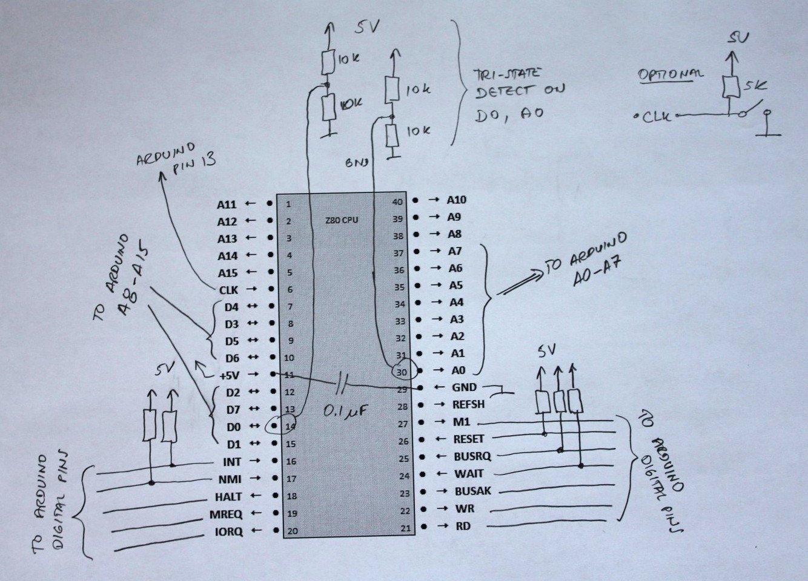

# Arduino and ZiLOG Z80

If you want to find out exactly what a venerable Z80 is doing on its bus
while executing instructions, in this post I outlined a dongle and the software
that will let you see that. Using just a few components and connecting them
to an Arduino Mega, you can trace instructions clock by clock and observe what’s
happening on the bus.

Start with a proto-board and solder down components following this schematics:



There is a capacitor between +5V and GND which should help keep away any voltage noise.
You can use anything: I had a 0.1uF tantalum cap that I used. The evil thing with not
putting bypass (or decoupling) caps in your designs is that you may never find out
why they might behave erratically.

There is also a push-button, which is optional. You might think it would be connected
to the reset pin but it is connected to the CLK – I wanted to be able to manually
clock the Z80 to see if it worked before hooking it up to Arduino. For the same reason,
every Z80 control input pin has a weak pull-up resistor. That should make it “alive and
kicking” right off the bat without the need for anything else externally driving it.

Now, the most interesting extension to the design is a tri-state bus detection.
Z80 occasionally puts its address and data buses into “High-Z”, or tri-state,
and I wanted to detect that (it also lets most of its control pins to Z,
but I was content to detect only the major buses.) There are 2+2 resistors
(each 10K) making up a weak resistor divider network connected to pins D0 and A0.
That way, whenever Z80 releases its data or address bus, the pins will assume 2.5V
pulled by resistor dividers. Since both buses are connected to analog input pins,
Arduino will be able to read the voltage and clearly detect that they are not
0V or 5V (logical 0 or 1) but somewhere in between.

After verifying that my 25-year old Z80 chip from my parts bin is still working (!),
I connected it to an Arduino Mega board. Mega is really useful here since it hosts
more I/O pins than you’d ever need, runs on +5V, and therefore needs no voltage
level translators to talk to Z80.

The connectors are conveniently clustered by their function: All eight data wires together,
address wires (I only used 8 for a max address space of 256 bytes), control signals
in two groups (one from each side of the Z80 package), and a few odd ones: clock,
which goes to pin 13 on Arduino and also powers the LED on it, and +5V and GND.
You can click on an image below to zoom on it —

The time is to write some software. Being a software engineer by trade comes in really useful
since many great hardware hobbyists totally drop the ball when it’s time to blow a breath of
life into their designs and write code, so they skim over that part. The Arduino software
that runs this dongle can be downloaded here.

Connected through a serial port, you have several commands available (type “?” or “h”
at the console):

```
s            - show simulation variables
s #var value - set simulation variable number to a value
sc           - clear simulation variables to their default values
r            - restart the simulation
:INTEL-HEX   - reload RAM buffer with a given data stream
m            - dump the content of the RAM buffer
mc           - clear the RAM buffer
```

There are several internal simulation variables that you can change in order to run your tests
on Z80 in various ways. The best way to create a Z80 test is to download a Z80 assembler
such as zmac and create a small test program. For example, create a test like this:

```
start:
    ei
    im 2
    ld ix, 80h
    srl (ix+20h),b
    adc hl, de
    ld hl, 30h
    ld de, 40h
    ld bc, 3h
    ldir
    ld bc, 1
    ldir
    halt
    org 38h
    ei
    reti
    org 66h
    ei
    reti
end
```

Functionally, this sequence does not make much sense, but it lets us test several things:
Instruction prefix IX, undocumented opcode, LDIR loop, HALT; then by inserting an NMI and INT
at certain places we can trace what’s going on when the CPU is servicing those interrupts.

Assemble it and zmac will generate several output files. Open an Intel-style hex file
that will show the code in hex; copy all and paste it into the Arduino serial terminal.

```
:10000000FBED5EDD218000DDCB2038ED5A21300094
:0E001000114000010300EDB0010100EDB076DB
:03003800FBED4D90
:03006600FBED4D62
:0000000000
```

Arduino will happily respond that it stored the stream of bytes and you can issue a command “m”
to dump the buffer (which Z80 sees as its RAM) to confirm that it is there:

```
    00 01 02 03 04 05 06 07 08 09 0A 0B 0C 0D 0E 0F
   +-----------------------------------------------
00 |FB ED 5E DD 21 80 00 DD CB 20 38 ED 5A 21 30 00
01 |11 40 00 01 03 00 ED B0 01 01 00 ED B0 76 00 00
02 |00 00 00 00 00 00 00 00 00 00 00 00 00 00 00 00
03 |00 00 00 00 00 00 00 00 FB ED 4D 00 00 00 00 00
04 |00 00 00 00 00 00 00 00 00 00 00 00 00 00 00 00
05 |00 00 00 00 00 00 00 00 00 00 00 00 00 00 00 00
06 |00 00 00 00 00 00 FB ED 4D 00 00 00 00 00 00 00
07 |00 00 00 00 00 00 00 00 00 00 00 00 00 00 00 00
08 |00 00 00 00 00 00 00 00 00 00 00 00 00 00 00 00
09 |00 00 00 00 00 00 00 00 00 00 00 00 00 00 00 00
0A |00 00 00 00 00 00 00 00 00 00 00 00 00 00 00 00
0B |00 00 00 00 00 00 00 00 00 00 00 00 00 00 00 00
0C |00 00 00 00 00 00 00 00 00 00 00 00 00 00 00 00
0D |00 00 00 00 00 00 00 00 00 00 00 00 00 00 00 00
0E |00 00 00 00 00 00 00 00 00 00 00 00 00 00 00 00
0F |00 00 00 00 00 00 00 00 00 00 00 00 00 00 00 00
Typing command “s” will show simulation variables that are available to us:

------ Simulation variables ------
#0 Trace both clock phases = 0
#1 Trace refresh cycles = 1
#2 Pause for keypress every = -1
#3 Stop after clock # = 40
#4 Stop after # M1 cycles = -1
#5 Stop at HALT = 1
#6 Issue INT at clock # = -1
#7 Issue NMI at clock # = -1
#8 Issue BUSRQ at clock # = -1
#9 Issue RESET at clock # = -1
#10 Issue WAIT at clock # = -1
#11 Clear all at clock # = -1
#12 Push IORQ vector #(hex) = FF
```

The code evolved over time and so did the variables and multitudes of situations that can
be set up by cleverly combining those values. In fact, this blog probably does not show
the most up-to-date software version.

As it runs, the trace program counts clocks and, by setting those variables, you can toggle
specific control pins at determined times. For example, if you want to issue an NMI at clock 20,
you would do “s 6 20”. You can optionally dump what’s happening on both clock phases and not
only on the positive phase (variable #0). Variable #1 will show or hide memory refresh cycles
that accompany M1.

Start the trace by issuing a command “r”. The Arduino starts the clocks and issues a RESET
sequence to Z80 after which your code runs and bus values are dumped out.

Notice the tri-state detection – when the address or data bus is being tri-stated by Z80,
the program outputs “–“. In fact, the data bus is being tri-stated most of the time!
This is a dump from the start of the run. The dumps are normally longer, but you get the idea.

```
Performing a RESET
Starting the clock
-----------------------------------------------------------+
#001H T1 AB:--- DB:-- RD                                   |
#002H T2 AB:--- DB:--                                      |
-----------------------------------------------------------+
#003H T1 AB:000 DB:-- M1                                   |
#004H T2 AB:000 DB:FB M1 MREQ RD      Opcode read from 000 -> FB
#005H T3 AB:000 DB:-- RFSH                                 |
#006H T4 AB:000 DB:-- RFSH MREQ       Refresh address 000  |
-----------------------------------------------------------+
#007H T1 AB:001 DB:-- M1                                   |
#008H T2 AB:001 DB:ED M1 MREQ RD      Opcode read from 001 -> ED
#009H T3 AB:001 DB:-- RFSH                                 |
#010H T4 AB:001 DB:-- RFSH MREQ       Refresh address 001  |
-----------------------------------------------------------+
```

Immediately we can see that Z80 uses 2 clocks of not doing anything externally after the reset.
The clock phase can be high (H) or low (L) and dumping lows is enabled by setting a simulation
variable #0 (by default, it does not dump low phases). T-cycles are being automatically counted
starting at every M1 cycle. This greatly helps to cross-check each instruction against
documentation. Input and output pins that are active are also tagged.

The Arduino simulator software provides data bytes to Z80 on memory read operations and stores
bytes into the internal buffer on memory write operations. Simulating an IO map is much simpler
where variable #12 can be used to push an arbitrary IORQ vector when needed.

Overall, the dongle itself and the options implemented by the Arduino [software](Z80_dongle.ino)
provide a powerful way to examine and visualize Z80 behavior whether it is running undocumented
opcodes or responding to a sequence of external control pins like interrupts, bus requests, etc.

